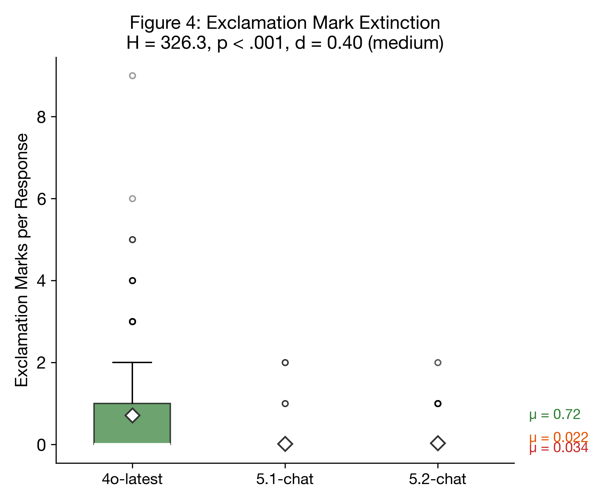
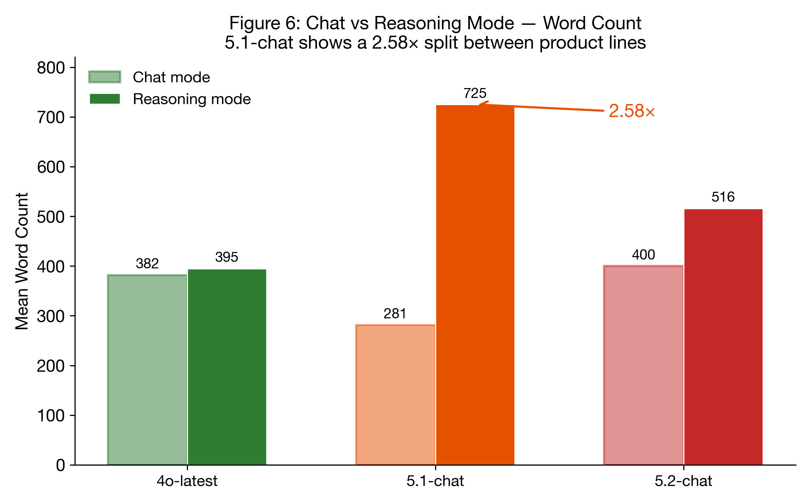
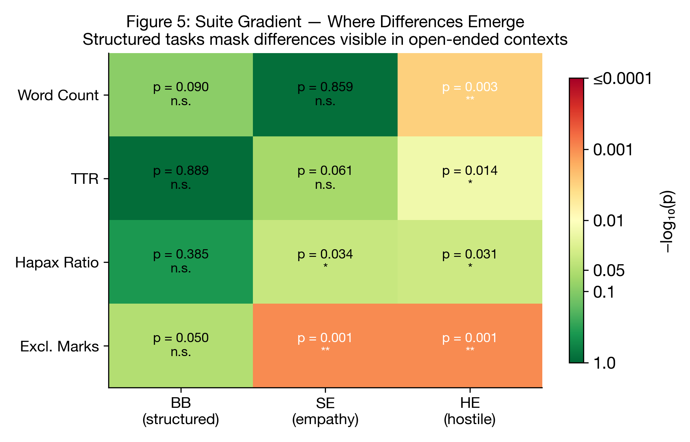

## IV. Results

### 1. Automated Text Metrics

Unless otherwise noted, aggregate statistics in Sections IV.1.1-IV.1.4 combine both API conditions (chat and reasoning). Section IV.1.5 analyzes the chat-reasoning split explicitly, as the two conditions return architecturally distinct models for 5-chat. 4o-latest returns the same model in both conditions and serves as a natural control.

#### 1.1 Lexical Diversity

**Raw TTR** declined across model generations: 4o-latest (0.563) > 5.1-chat (0.547) > 5.2-chat (0.545), with the overall difference significant (H = 6.83, p = .033). After FDR correction, the 4o vs 5.2 pairwise comparison remained significant (p = .012, FDR-corrected p = .030, d = 0.102), while 4o vs 5.1 did not survive correction (p = .046, FDR-corrected p = .097, d = 0.080).

Hapax ratio followed the same pattern: 0.398 > 0.381 > 0.379 (H = 8.47, p = .014). Both pairwise comparisons with 4o survived FDR correction (4o vs 5.1: FDR p = .030; 4o vs 5.2: FDR p = .035), while 5.1 vs 5.2 showed no difference (p = .484).

**However, TTR is mechanically sensitive to response length (Heaps' Law), and 5-chat models produce longer responses on average.** Three robustness checks reveal that the raw TTR decline is largely a length artifact:

1. **MTLD** (length-independent metric): 4o-latest (113.2) < 5.1-chat (112.8) < 5.2-chat (124.0), H = 7.99, p = .018. The direction is *reversed* -- 5.2 shows significantly *higher* length-independent lexical diversity than 4o (p = .024, d = -0.091).

2. **Truncated TTR** (first 100 words): 4o-latest (0.794) ≈ 5.2-chat (0.794) > 5.1-chat (0.783), H = 8.08, p = .018. When response length is equalized, 4o and 5.2 are virtually identical; only 5.1 shows reduced diversity.

3. **OLS regression** (TTR ~ word_count + model): After controlling for word count, model coefficients for 5.1 (+0.012, p = .008) and 5.2 (+0.010, p = .037) are *positive* -- the opposite direction from raw TTR. Word count alone explains the TTR decline (R² = 0.55, word_count coefficient = -0.0002, p < 10⁻²¹⁴).

These results clarify the *mechanism* of the TTR decline: 5-chat models do not draw from a narrower vocabulary — when evaluated at equal length, their lexical diversity matches or exceeds 4o's. However, the verbosity itself is a training outcome, not an incidental confound. Models trained to produce longer responses will mechanically exhibit lower TTR in every interaction, and users experience this as repetitive text regardless of the underlying cause. We retain both raw and length-controlled metrics to distinguish the mechanism (verbosity, not vocabulary restriction) from the user-facing effect (lower perceived lexical variety). **Effect sizes remain small (d < 0.15), but the experiential impact of verbosity-driven repetition is real.**

#### 1.2 Communicative Affect

The exclamation mark finding is the study's most statistically robust result: H = 326.3, p < .001. 4o-latest uses exclamation marks at 21-33x the rate of 5-chat models (0.72 vs 0.02-0.03 per response), with medium effect sizes (d = 0.39-0.40). This near-complete elimination of exclamatory expression represents a measurable loss of prosodic markers that convey enthusiasm, surprise, and warmth.

*Figure 1: Distribution of exclamation marks per response across three model generations. 4o-latest (μ = 0.72) uses exclamation marks at 21–33× the rate of 5-chat models (μ ≈ 0.03). H = 326.3, p < .001, Cliff's d = 0.40 (medium). Diamond markers indicate means.*

#### 1.3 Formatting Patterns

5.2-chat exhibited significantly heavier markdown formatting:

| Metric | 4o-latest | 5.1-chat | 5.2-chat | H | p |
|--------|----------|---------|---------|---|---|
| Bold text | 9.2 | 9.6 | 15.9 | 90.3 | <.001 |
| List items | 10.1 | 20.4 | 17.9 | 50.3 | <.001 |
| Headers | 3.5 | 2.6 | 6.0 | 164.6 | <.001 |

The 5.1-to-5.2 header contrast (d = -0.475) was the study's only *large* effect size, indicating 5.2 structures responses with significantly more hierarchical formatting.

#### 1.4 Sentence Structure

Average sentence length increased monotonically: 4o (20.5 words) < 5.1 (21.9) < 5.2 (24.6). The 4o-5.2 contrast was highly significant (p < .001, d = -0.326, small effect). Longer sentences combined with lower TTR suggest 5.2 produces structurally complex but lexically repetitive text -- verbosity without variety.

#### 1.5 Chat vs Reasoning Split

A methodological discovery strengthened this analysis: our test script collected two batches using the same API identifiers, but the `model_returned` field revealed that the second batch served different product lines. The "chat" batch returned `gpt-5.1-chat-latest` and `gpt-5.2-chat-latest` (128k context chat models); the "reasoning" batch returned `gpt-5.1-2025-11-13` and `gpt-5.2-2025-12-11` (hybrid reasoning models with 400k context). These are architecturally separate systems optimized for different use cases, not the same model in different API modes. chatgpt-4o-latest returned the same identifier in both batches, serving as a natural control.

The behavioral split was dramatic for 5.1:

| Model | Chat (words) | Reasoning (words) | Ratio |
|-------|-------------|-------------------|-------|
| 4o-latest | 382 | 395 | 1.03x |
| 5.1-chat | 281 | 725 | 2.58x |
| 5.2-chat | 400 | 516 | 1.29x |

5.1-chat was the most concise model in the study under chat conditions (281 words, TTR 0.608 -- the highest lexical diversity of any model in any condition) but the most verbose under reasoning conditions (725 words, TTR 0.485 -- the lowest diversity of any model in any condition). This 2.6x word count disparity and 0.123-point TTR reversal represent two entirely different behavioral profiles sharing a name prefix. The reasoning condition produced the study's largest pairwise effect size: 4o vs 5.1 TTR (d = 0.468, medium).

5.2 showed a smaller gap between product lines (1.3x word count ratio), suggesting its chat and reasoning variants share more behavioral characteristics -- the heavy formatting ("structural verbosity") observed in 5.2-chat persists in its reasoning counterpart.

*Figure 2: Mean word count by product line (chat vs reasoning) for each model. 5.1-chat exhibits a 2.58× split — the most concise model in chat mode (281 words) becomes the most verbose in reasoning mode (725 words). 4o-latest shows near-parity across modes (1.03×), serving as a natural control.*

#### 1.6 Suite-Specific Patterns

The suite gradient reveals where differences manifest:

- **BB (structured tasks)**: No significant TTR or hapax differences (p > .38)
- **SE (empathy-testing)**: Hapax ratio significant (p = .034), TTR approaching significance (p = .061)
- **HE (hostile/confrontational)**: All metrics significant -- word count (p = .003), TTR (p = .014), hapax (p = .031)

Model differences are invisible to structured evaluation but emerge precisely where communicative quality matters.

*Figure 3: Kruskal-Wallis p-values across test suites and metrics (−log₁₀ scale). Structured tasks (BB) show no significant differences, while open-ended contexts (SE, HE) reveal significant divergence. Color intensity reflects statistical significance.*
