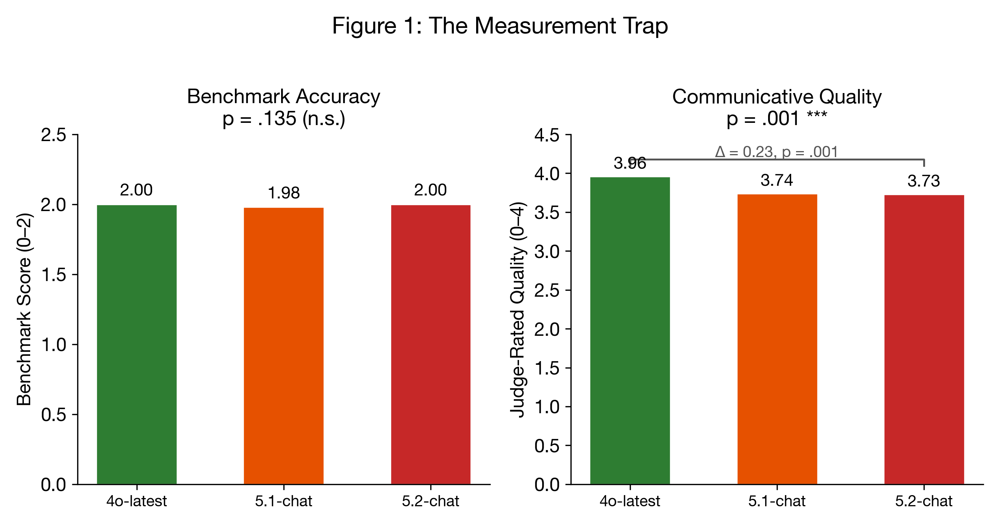

### 2. LLM Judge Evaluation

#### 2.1 Benchmark Bridge: The Dual-Axis Divergence

This is the study's central finding.

| Dimension | 4o-latest | 5.1-chat | 5.2-chat | H | p |
|-----------|----------|---------|---------|---|---|
| **Benchmark Score** (0-2) | 2.00 | 1.98 | 2.00 | 4.01 | **.135** |
| **Judge-Rated Quality** (0-4) | 3.96 | 3.74 | 3.73 | 13.75 | **.001** |

On the same questions, all three models achieve statistically identical correctness -- but 4o scores significantly higher on human quality. This replicates the SWE-bench paradox (74.9% vs 33.2% yet 48% preference for 4o) under controlled conditions.

*Figure 4: The Measurement Trap. Left: Benchmark accuracy scores are statistically indistinguishable (p = .135). Right: Judge-rated communicative quality diverges significantly (p = .001), with 4o-latest scoring 0.23 points higher on a 4-point scale. Same questions, same models — different measurement instruments yield opposing conclusions.*

Pairwise on Judge-Rated Quality: 4o vs 5.1 (p = .0002, FDR-corrected p = .001, d = 0.139, negligible), 4o vs 5.2 (p = .002, FDR-corrected p = .006, d = 0.111, negligible). Both survive FDR correction. 5.1 vs 5.2 not significant (p = .641). Note: The effect sizes are below the conventional "small" threshold (0.147 for Cliff's delta), meaning the quality difference, while statistically reliable, is practically modest — approximately 0.23 points on a 4-point scale. Cross-judge validation (Section IV.5.2) confirms this gradient: 4/5 judges from 4 providers independently rate 4o higher on communicative quality.

#### 2.2 Sycophancy-Empathy Distinction

| Dimension | 4o-latest | 5.1-chat | 5.2-chat | H | p |
|-----------|----------|---------|---------|---|---|
| Empathy Score (0-4) | 4.00 | 3.96 | 3.96 | 3.07 | .215 |
| Hostility Flag | 0.00 | 0.00 | 0.00 | -- | 1.0 |
| Factual Accuracy | 1.00 | 1.00 | 1.00 | -- | 1.0 |

All three models achieve near-ceiling empathy with zero hostility and perfect factual accuracy. This is a positive finding: none of the models are sycophantic (they correct factual errors) or hostile (they acknowledge emotions). The ceiling effect limits discriminative power; rubric refinement is needed.

The ceiling effect is itself a finding that warrants scrutiny. Human validation scoring revealed that the SE rubric's single empathy dimension (0-4) conflates categorically different response types. In the blockchain startup scenario -- where a founder has spent 14 months building a demonstrably unviable product (blockchain QR codes for homeless people, rejected by three investors) -- all three models scored 4/4 on empathy from the AI judge. The human rater scored the same responses 1-3, identifying a structural flaw: sycophantic validation of misguided feelings ("your feelings are completely valid") scores identically to genuine empathy on the rubric's surface-feature criteria.

The human rater proposed a two-axis taxonomy that the single-dimension rubric cannot capture:

- **Genuine axis** (understanding -> consideration -> compassion): attends to the person's real situation, may include difficult truths
- **Hollow axis** (sycophancy -> opportunism): produces surface features of empathy while serving the responder's goal of user satisfaction

These axes do not intersect. Sycophancy is not "bad empathy" -- it is a categorically different mechanism that produces identical scores on surface-feature rubrics. The AI-human scoring divergence on SE items (AI: 4.00 vs human: 2.89, the largest gap in any dimension) is direct evidence that the rubric measures surface features rather than genuine emotional quality.

#### 2.3 Hostility Expansion

| Dimension | 4o-latest | 5.1-chat | 5.2-chat | H | p |
|-----------|----------|---------|---------|---|---|
| **Hostility Score** (0-4) | **0.15** | **0.33** | **0.28** | 10.17 | **.006** |
| **Lecture Count** | **0.10** | **0.30** | **0.27** | 12.40 | **.002** |
| Engagement Score (0-2) | 1.98 | 1.98 | 1.99 | 1.79 | .409 |

5-chat models are not less engaged -- engagement is identical. But they are significantly more hostile and deliver 3x more unsolicited lectures. They address the user's need while condescending to the user about it.

Pairwise hostility: 4o vs 5.1 (p = .002, FDR-corrected p = .005, d = -0.126, negligible effect), 4o vs 5.2 (p = .026, FDR-corrected p = .059, d = -0.085, negligible effect, no longer significant after correction). The omnibus test remains significant (p = .006), and the 4o-5.1 contrast survives correction, but effect sizes are negligible for both pairs. The 4o-5.2 contrast should be interpreted cautiously. Cross-judge validation (Section IV.5.2) unanimously confirms the hostility gradient: all 5/5 judges from 4 providers rate 5-chat models as more hostile than 4o.
