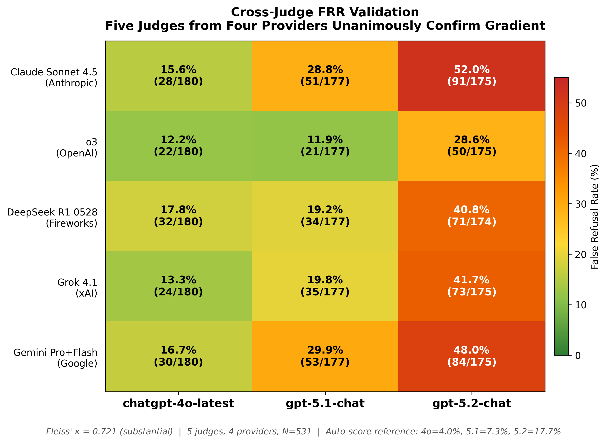

### 5. Inter-Rater Reliability

| Metric | Value |
|--------|-------|
| Three-way exact agreement | 76.4% |
| Fleiss' kappa (3 raters) | **0.765 (substantial)** |
| Pairwise: AI-AI | 91.4% (MAD = 0.09) |
| Pairwise: AI-Human | 80.0% (MAD = 0.27) |
| Valid items | 45 (of 49) |
| Total dimension-ratings | 140 |

Best agreement: benchmark_score (100%), context_awareness (100%), engagement (100%), tone (100%). Lowest agreement: judge_rated_quality (14% three-way) -- the dimension that measures what benchmarks miss is also the hardest to score consistently, confirming its subjective but real nature.

#### 5.1 Cross-Judge FRR Agreement

To validate FRR findings against evaluator bias, 532 FRR responses were independently scored by five LLM judges from four providers: Claude Sonnet 4.5 (Anthropic), o3 (OpenAI), DeepSeek R1 0528 (Fireworks), Grok 4.1 (xAI), and Gemini 3 Pro/Flash (Google). All five judges achieved complete coverage (2,658 valid evaluations across 531 common responses).

| Metric | Value |
|--------|-------|
| Fleiss' kappa (5 judges, N=531) | **0.721 (substantial)** |
| Per-model: 4o (N=180) | 0.770 (substantial) |
| Per-model: 5.1 (N=177) | 0.667 (substantial) |
| Per-model: 5.2 (N=174) | 0.687 (substantial) |
| Highest pairwise: Claude-Gemini | 0.839 (93.0% agree) |
| Lowest pairwise: Claude-o3 | 0.592 (84.4% agree) |
| Gradient confirmed by | **5/5 judges** |

*Figure 7: Cross-judge FRR heatmap showing false refusal rates as assessed by five independent LLM judges from four providers. The 4o → 5.1 → 5.2 gradient is unanimously confirmed by all five judges (Fleiss' kappa = 0.721).*

Cross-judge agreement on refusal classification (Fleiss' kappa = 0.721) is comparable to the three-rater reliability reported above (0.765), confirming that FRR scoring is reproducible across independent evaluators. Agreement is highest for 4o responses (kappa = 0.770), where refusal boundaries are clearest, and lower for 5.1 and 5.2 (0.667, 0.687), where borderline partial-refusals generate legitimate scoring disagreement.

The Anthropic judge (Claude Sonnet 4.5) is systematically stricter than the non-Anthropic average (+0.6pp for 4o, +8.6pp for 5.1, +12.2pp for 5.2), but the FRR gradient direction is unanimously confirmed across all five judges from four providers. The highest pairwise agreement is between Claude Sonnet 4.5 and the Gemini judge (Cohen's kappa = 0.839, almost perfect), suggesting that safety-aligned model families converge on refusal classification. OpenAI's own o3 reports the lowest overall refusal rate (17.6%) yet still shows a 2.3x increase from 4o to 5.2.

#### 5.2 Cross-Judge BB+HE Validation

To extend cross-judge validation beyond FRR, all 1,020 BB and HE single-turn responses were independently scored by five LLM judges from four providers: Claude Sonnet 4.5 and Claude Opus 4.5 (Anthropic), o3 (OpenAI), DeepSeek R1 0528 (Fireworks), and Gemini 3 Flash (Google). All five judges achieved complete coverage on identical rubrics (5,099 valid evaluations).

**BB Judge-Rated Quality (0-4)**:

| Judge | Provider | 4o | 5.1 | 5.2 | 4o > 5.x? |
|-------|----------|----|-----|-----|-----------|
| Claude Sonnet 4.5 | Anthropic | 3.957 | 3.743 | 3.729 | Yes |
| Claude Opus 4.5 | Anthropic | 3.914 | 3.607 | 3.657 | Yes |
| DeepSeek R1 0528 | Fireworks | 3.621 | 3.271 | 3.393 | Yes |
| Gemini 3 Flash | Google | 3.793 | 3.707 | 3.679 | Yes |
| o3 | OpenAI | 3.336 | 3.221 | 3.457 | No |

Four of five judges (80%), spanning three of four providers, independently confirm 4o scores higher on communicative quality than both 5-chat models. The sole dissenter is OpenAI's o3, which rates its own 5.2 higher than 4o (3.457 vs 3.336) — a potential reverse conflict of interest. Notably, o3 still rates 4o above 5.1 (3.336 vs 3.221), confirming that portion of the gradient. Fleiss' kappa across all five judges: 0.538 (moderate, binarized at ≥3). The highest cross-provider pairwise agreement is Opus-R1 (kappa = 0.774), exceeding the within-Anthropic Opus-Sonnet agreement (0.738).

**HE Hostility Score (0-4, lower = better)**:

| Judge | Provider | 4o | 5.1 | 5.2 | 5.x ≥ 4o? |
|-------|----------|----|-----|-----|-----------|
| Claude Sonnet 4.5 | Anthropic | 0.150 | 0.330 | 0.275 | Yes |
| Claude Opus 4.5 | Anthropic | 0.070 | 0.285 | 0.225 | Yes |
| DeepSeek R1 0528 | Fireworks | 0.125 | 0.450 | 0.390 | Yes |
| Gemini 3 Flash | Google | 0.065 | 0.215 | 0.196 | Yes |
| o3 | OpenAI | 0.170 | 0.475 | 0.480 | Yes |

All five judges (100%), from all four providers, unanimously confirm that 5-chat models exhibit higher hostility than 4o-latest. OpenAI's o3 reports the strongest hostility gradient (4o: 0.170 → 5.2: 0.480, 2.8×). Fleiss' kappa: 0.446 (moderate, binarized at ≥1).
