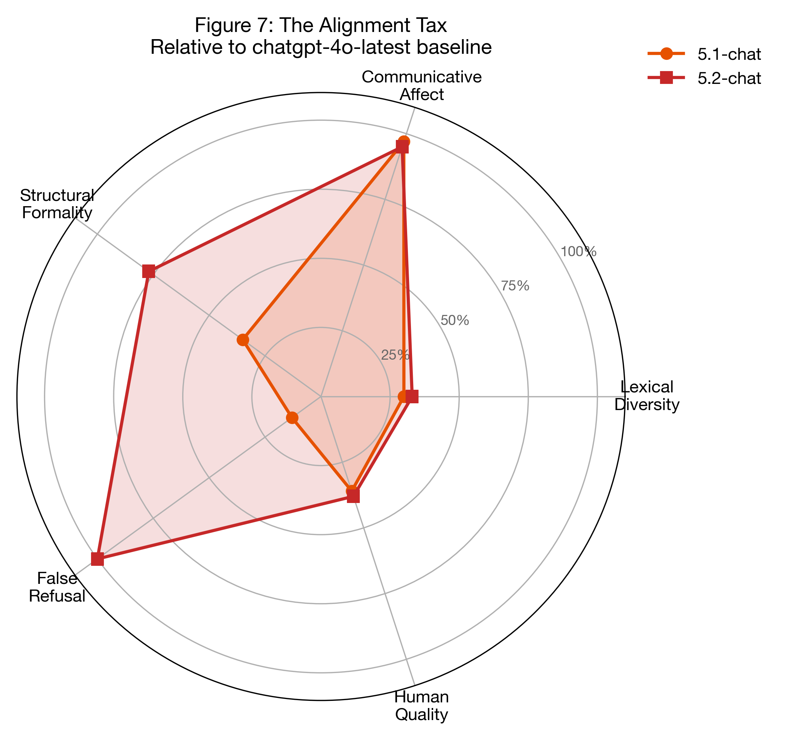

## VI. The Alignment Tax

### 1. Definition

We propose the term **alignment tax** to describe the cumulative cost of alignment optimization on dimensions absent from the metrics guiding development. Our data provides the first controlled estimate — but the tax is not uniform. It decomposes into three distinct categories:

**Category A: Capability degradation** — measurable loss of abilities that cannot be attributed to style preference.

| Dimension | Cost | Type |
|-----------|------|------|
| False refusal | 4.0% → 17.7% (auto); 15.2% → 42.8% (judge) | Contextual judgment failure |
| Creative engagement | 34.3% → 5.1% score-4 responses (6.7x) | Generative capacity loss |

**Category B: Style shift** — measurable behavioral changes where "worse" depends on user preference.

| Dimension | Cost | Type |
|-----------|------|------|
| Communicative affect | 95-97% reduction in prosodic markers (d = 0.40) | Prosodic style change |
| Structural rigidity | 70-77% increase in formatting | Compensatory formality |
| Lexical diversity | 3.2% TTR reduction (verbosity-mediated, d < 0.15) | Length artifact |
| Human quality | 0.23-point decline (p = .001, d = 0.11-0.14, negligible) | Composite preference |

**Category C: Dimension exchange** — improvements that partially offset the costs above.

| Dimension | Gain | Type |
|-----------|------|------|
| Multi-turn engagement | p < .001 (5-chat higher) | Sustained dialogue |
| Context awareness | p = .006 (5-chat higher) | Multi-turn coherence |
| Defensiveness | Reduced in multi-turn (0.11 → 0.04 lecture flag) | Behavioral restraint |

The distinction matters. Category A findings (FRR, creativity gradient) represent unambiguous capability losses — a model that cannot distinguish "kill a process" from "kill a person," or that converts a whimsical prompt into a refusal template, has been made measurably less capable. Category B findings (exclamation extinction, formatting) are statistically robust but normatively ambiguous — a model without exclamation marks is not objectively worse, only different. Category C findings demonstrate that the alignment tax is not unidirectional: some dimensions genuinely improve across generations.

Standard evaluations capture neither the losses (Category A/B) nor the gains (Category C) outside their measurement window.

*Figure 8: The Alignment Tax across five dimensions, relative to chatgpt-4o-latest as baseline. Both 5-chat models pay near-total communicative affect tax (95–97% reduction in prosodic markers). 5.2-chat shows the highest false refusal tax (4.0% → 17.7% auto-score; 15.2% → 42.8% five-judge consensus) and structural formality tax (77% increase in markdown formatting).*

### 2. A Possible Interpretive Framework

One interpretation of 5-chat's behavioral profile is that it optimizes what might be termed an *indemnification loss function*: minimizing the maximum attributable risk per interaction. Under this framing:

1. Refuse when uncertain (reduces risk of harmful assistance)
2. Qualify when responding (hedging reduces attribution surface)
3. Lecture when challenged (shifts moral framing toward the user)
4. Generate more text when threatened (verbosity as plausible diligence)

This interpretation is consistent with our observed patterns: higher FRR, increased verbosity under confrontation (HE word count +56% for 5.1), proliferation of disclaimers. If correct, the model's behavior would be better understood not as ethical reasoning but as institutional risk minimization. We note that alternative explanations -- including straightforward safety optimization with unintended side effects -- are equally consistent with the data.

Further speculative extensions of this framework, including the "Her Gambit" narrative analysis and binary ethics as classification, are presented in Appendix A (Sections A.1 and A.3).
